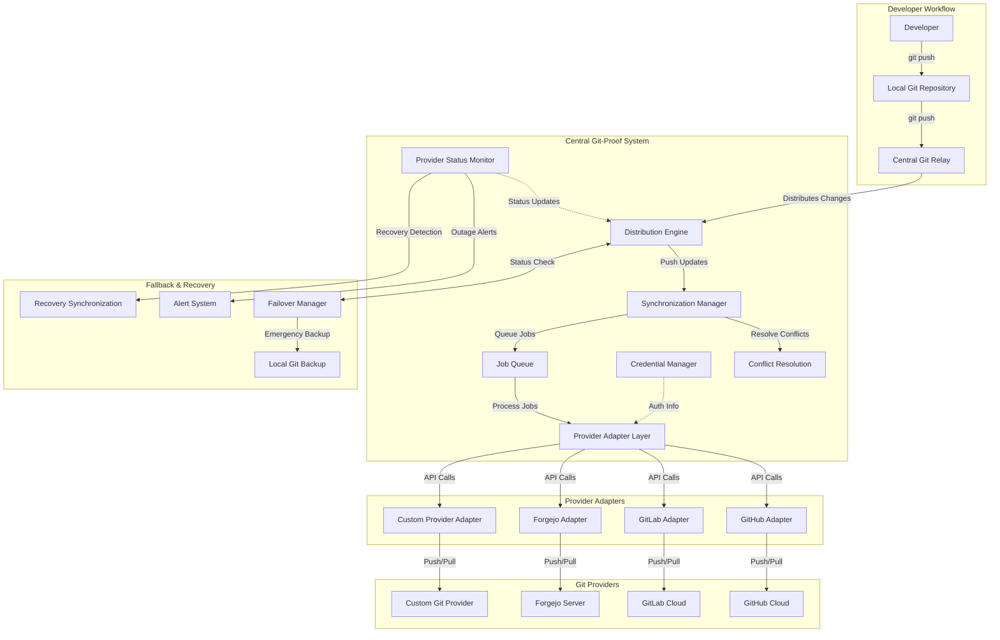

# GitProof <!-- omit in toc -->

GitProof is a Next.js application designed to provide a robust, centralized system for managing Git repositories across multiple providers. It ensures that developers can push their changes to a local repository, which then synchronizes with various remote Git providers, maintaining consistency and reliability.

- [High level architecture](#high-level-architecture)
- [Getting Started](#getting-started)

## High level architecture



Supported Git providers include:

- GitHub
- GitLab
- Codeberg
- Self-hosted GitLab
- Self-hosted Forgejo
- Self-hosted Gitea

## Getting Started

First, run the development server:

```bash
pnpm dev
```

Open [http://localhost:3000](http://localhost:3000) with your browser to see the result.
