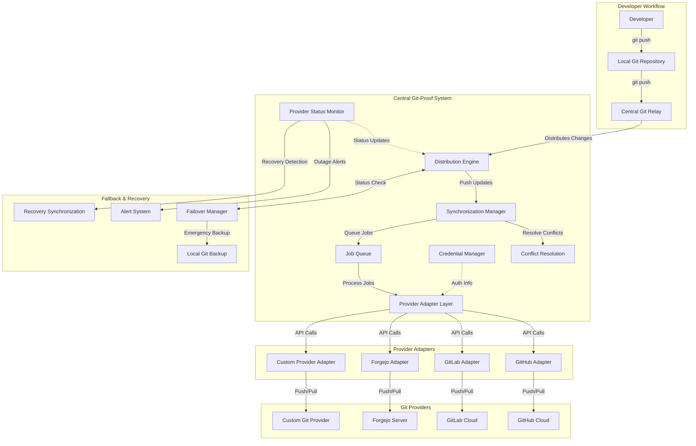

# GitProof <!-- omit in toc -->

GitProof is a Next.js application designed to provide a robust, centralized system for managing Git repositories across multiple providers. It ensures that developers can push their changes to a local repository, which then synchronizes with various remote Git providers, maintaining consistency and reliability.

- [Getting Started](#getting-started)
  - [Environment Setup](#environment-setup)
  - [Database Setup](#database-setup)
  - [Start Development Server](#start-development-server)
- [High level architecture](#high-level-architecture)
- [API Endpoints](#api-endpoints)
  - [Dashboard](#dashboard)
  - [Providers](#providers)
  - [Sync Queue](#sync-queue)
  - [Failover](#failover)
  - [Backup](#backup)


## Getting Started

### Environment Setup

```bash
cp .env.example .env
```

Edit `.env` with your configuration.

### Database Setup

```bash
# Generate Prisma client
pnpm run db:generate

# Run migrations
pnpm run db:migrate

# Seed database with sample data
pnpm run db:seed
```

### Start Development Server

```bash
pnpm run dev
```

Three web applications will be available:
- **GitProof Dashboard**: The main application interface: http://localhost:3000
- **pgAdmin**: PostgreSQL administration interface: http://localhost:8080
  - **Email**: admin
  - **Password**: admin
- **Redis Commander**: Redis administration interface: http://localhost:8081

## High level architecture



The backend is built using:

- **Next.js API Routes** - RESTful API endpoints
- **Prisma ORM** - Type-safe database access
- **SQLite** - Development database (easily swappable to PostgreSQL)
- **BullMQ** - Job queue for asynchronous operations
- **TypeScript** - Type safety throughout the codebase


## API Endpoints

### Dashboard
- `GET /api/dashboard/stats` - Get system statistics
- `GET /api/dashboard/activity` - Get recent activity

### Providers
- `GET /api/providers` - List all providers
- `POST /api/providers` - Create a new provider
- `GET /api/providers/[id]` - Get provider details
- `PUT /api/providers/[id]` - Update provider
- `DELETE /api/providers/[id]` - Delete provider
- `POST /api/providers/[id]/test` - Test provider connection

### Sync Queue
- `GET /api/sync-queue` - List sync jobs (with filters)
- `POST /api/sync-queue` - Create new sync job
- `GET /api/sync-queue/stats` - Get queue statistics
- `PUT /api/sync-queue/[id]/priority` - Update job priority
- `DELETE /api/sync-queue/[id]` - Cancel sync job

### Failover
- `GET /api/failover/events` - List failover events
- `POST /api/failover/events` - Create failover event
- `GET /api/failover/rules` - Get failover rules
- `PUT /api/failover/rules` - Update failover rules

### Backup
- `GET /api/backup/status` - Get backup status
- `POST /api/backup/status` - Trigger manual backup